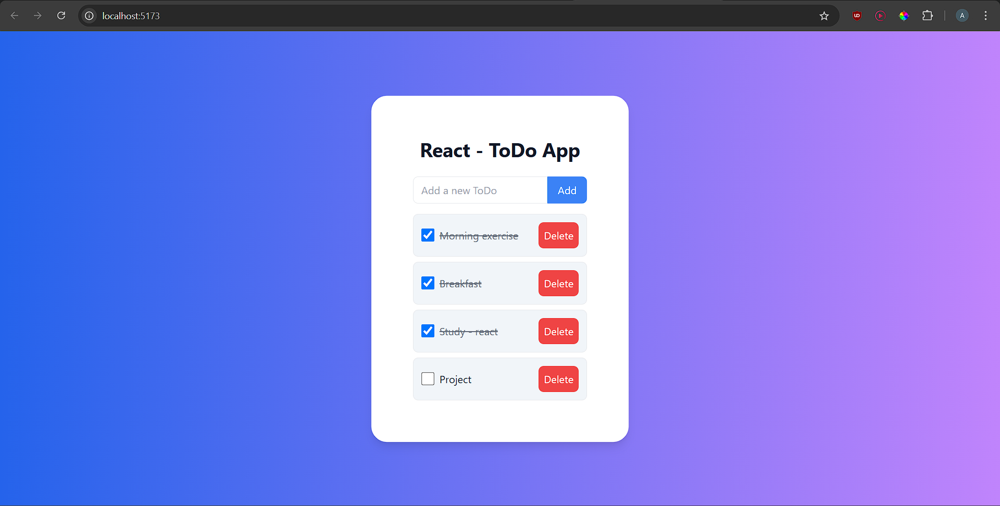

# Demo


# Installation
1. **Clone the repository:**
bash```
https://github.com/Spark-11/HashedBit_Assignments.git
cd Assignment-06
```
2. **Install the dependencies :**
bash```
npm i
```
3. **Start the dev server :**
bash```
npm run dev
```